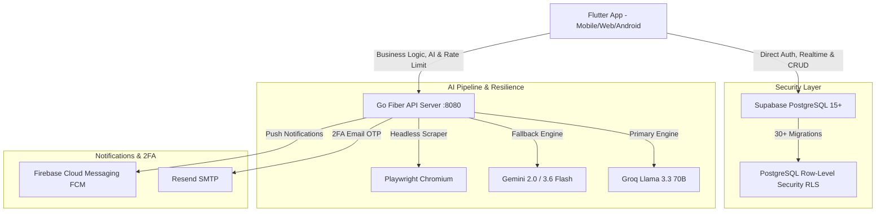

# 🛒 Kap-App — AI-Powered Household Inventory & Smart Shopping Platform


-00ADD8?logo=go)


-blue)

**Kap-App** is a production-grade, multi-platform household shopping and inventory management system built with a **hybrid backend architecture** (Supabase + Go Microservice), functional error handling, database-level security policies (RLS), and resilient multi-engine AI pipelines.

---

## 🏗️ System Architecture



---

## 🌟 Key Technical Features & Engineering Highlights

### 1. Hybrid Backend Architecture (Go + Supabase)
- **Supabase BaaS:** Handles authentication, real-time WebSocket subscriptions, and raw CRUD queries for ultra-low latency.
- **Go (Fiber v2) Microservice:** Encapsulates heavy business logic, unique group join-code generation, rate limiting, and AI orchestration.

### 2. Functional & Crash-Free Mobile App (Flutter 3.x + Riverpod 3 + `fpdart`)
- **State Management:** Reactive architecture using Riverpod 3 (`AsyncNotifier`, `Notifier`, `FutureProvider`).
- **FP Error Handling:** Eliminates uncaught runtime crashes by returning `Either<Failure, T>` across all repository contracts.
- **Zero Hardcoded Strings:** Full internationalization (`.arb` i18n) supporting English and Turkish.

### 3. Database-Level Security (PostgreSQL Row-Level Security)
- **Granular Data Isolation:** Enforced via 30 ordered SQL migration files. Private requests (`is_private`) and group items are protected at the database query level via `is_group_member()` functions—never relying on application-layer filtering alone.

### 4. Resilient AI Pipeline (Groq + Gemini Fallback + Playwright Scraper)
- **Receipt OCR & Price Estimator:** Extracts items and prices from receipt images.
- **Automatic Fallback:** If the primary Groq Llama model hits rate limits or times out, the backend seamlessly fails over to Gemini Flash.
- **Playwright Headless Scraper:** Fetches real-time Turkish grocery market prices on-demand as a secondary fallback.

### 5. Nutrition Engine v2 & Personal Health (`/health`)
- **BMR & TDEE Calculation:** Implements Mifflin-St Jeor formulas.
- **Medical & Safety Guardrails:**
  1. *Calorie Floor Guardrail:* Triggers critical warning banners if target calories drop below 1200 (female) or 1500 (male).
  2. *Protein & Kidney Guardrail:* Follows ISSN standards (0.8–2.4 g/kg) and strictly caps protein at 0.8 g/kg if kidney disease is flagged.
  3. *Allergen Exclusion Guardrail:* Dynamically filters out allergens (peanuts, gluten, lactose, etc.) from food recommendations.

### 6. Admin Panel & In-App OTA Update System (`/admin`)
- **Over-The-Air (OTA) Updates:** Allows broadcasting in-app APK version updates and mandatory update enforcement.
- **Scheduled Automated Reminders:** Local and push notifications triggered for daily reminders (12:00 Water, 17:00 Market, 20:00 Nutrition).

---

## 📂 Project Structure

```
Kap-App/
├── kap-app-front/                # FLUTTER FRONTEND
│   └── lib/
│       ├── core/                 # Abstract contracts, AppError, failures & router
│       ├── features/             # Feature-First Architecture
│       │   ├── admin/            # OTA release & notification dashboard
│       │   ├── auth/             # Authentication & 2FA OTP screens
│       │   ├── groups/           # Household group management & join codes
│       │   ├── health/           # Nutrition Engine v2 & health profiles
│       │   ├── inventory/        # Home stock management (in-stock / low / out)
│       │   ├── requests/         # Realtime shopping list, OCR & AI recommendations
│       │   └── subscription/     # Quota tracking & tier management
│       └── shared/               # CategoryHelper, FitnessCalculator, FoodDatabase
│
├── kap-app-backend/              # GO (FIBER) BACKEND API
│   ├── cmd/server/main.go        # Server entrypoint & route registration
│   ├── internal/
│   │   ├── handler/              # HTTP handlers (AI, Auth, Subscriptions)
│   │   ├── service/              # Core business services
│   │   ├── repository/           # Supabase DB client & data access
│   │   └── middleware/           # JWT validation, CORS & rate-limiting
│   └── scripts/                  # Playwright headless price scraper
│
└── supabase/                     # DATABASE & MIGRATIONS
    └── migrations/               # 30+ SQL migrations (Schema, RLS policies, Triggers)
```

---

## 🧪 Testing & CI/CD Pipeline

The project enforces strict quality standards via an automated **GitHub Actions CI/CD Pipeline** (`.github/workflows/ci.yml`):

- **Backend:** `go vet ./...` & `go test -v -race ./...` (Unit & Integration tests)
- **Frontend:** `flutter analyze` & `flutter test` (Unit tests for CategoryHelper, FitnessCalculator, FoodDatabase)
- **E2E Testing:** Playwright Chromium headless integration tests (`e2e/shopping_isolation.spec.ts`)

---

## 🚀 Local Setup & Getting Started

### Prerequisites
- Flutter SDK (v3.x)
- Go (v1.24+)
- Node.js (v20+ for Playwright)
- Supabase CLI

### 1. Backend Setup
```bash
cd kap-app-backend
go mod download
go run cmd/server/main.go
```

### 2. Frontend Setup
```bash
cd kap-app-front
flutter pub get
flutter run -d chrome
```

---

## 📜 License
This project is open-source and available under the [MIT License](LICENSE).
